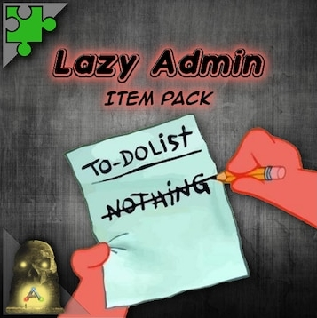

# LazyAdmin Writeup

## NMAP Scan
```
Starting Nmap 7.93 ( https://nmap.org ) at 2022-11-13 20:13 GMT
Nmap scan report for 10.10.143.11
Host is up (0.039s latency).
Not shown: 998 closed tcp ports (conn-refused)
PORT   STATE SERVICE VERSION
22/tcp open  ssh     OpenSSH 7.2p2 Ubuntu 4ubuntu2.8 (Ubuntu Linux; protocol 2.0)
| ssh-hostkey: 
|   2048 497cf741104373da2ce6389586f8e0f0 (RSA)
|   256 2fd7c44ce81b5a9044dfc0638c72ae55 (ECDSA)
|_  256 61846227c6c32917dd27459e29cb905e (ED25519)
80/tcp open  http    Apache httpd 2.4.18 ((Ubuntu))
|_http-server-header: Apache/2.4.18 (Ubuntu)
|_http-title: Apache2 Ubuntu Default Page: It works
```
Viewing the webpage on port 80, we can see that it is the standard Apache2 webpage, nothing interesting so I ran a gobuster scan.

## Gobuster Scan
```
/content
/content/as
```
Browsing to **/content** we can see the standard webpage for a CMS named Sweetrice and **/content/as** is a login page for Sweetrice. I searched around to see if there were any CVE's for Sweetrice and found a few. One for arbitrary file upload, however that needed a username and password. But there was another that caught my eye, it was a **MySQL database backup exposure**.

The database backup is located at **/inc/mysql_backup**. We can download the database and reading it we can see a username **manager** and a password hash.

We can use JohnTheRipper or Hashcat to crack the hash. Cracking the hash, it reveals a password for **manager**

`manager:[REDACTED]`

Now we can use the credentials to login at **/content/as**. Success! It logged me into a dashboard named **Media Center** that allows file upload.

## Foothold
Sweetrice CMS runs on PHP, this means we can use a PHP webshell or PHP reverse shell to get remote code execution on the machine. I first tried to upload a **.php** file, but that did not work, so I then tried **.php5** which worked! Now it's time to upload a PHP reverse shell. I like to use one made by `pentestmonkey` on GitHub. You can find it [here](https://github.com/pentestmonkey/php-reverse-shell/blob/master/php-reverse-shell.php).

Remember to change the IP and Port in the revserse shell, to your listener IP and Port, before saving the file as **.php5** and uploading it.

Now we start a listener `nc -nvlp <port>`.

Upload the **.php5** file and navigate to the file on the webserver to activate it. Now check the listener and we have a shell on the machine!

## Privilege Escalation (root)
First thing I did was stabilize the shell `python -c 'import pty;pty.spawn("/bin/bash")'` and saw that I had a shell as **www-data**.

I changed directory into **/home** and saw there was a directory **/home/itguy**. Changing directory into that, there were 3 files present:
```
user.txt
mysql_login.txt
backup.pl
```
- **user.txt** is the first flag needed for the CTF.
- **mysql_login.txt** contains login credentials for a MySQL database, which I did not end up using.
- **backup.pl** is a script that calls a bash script `/etc/copy.sh`

Running `sudo -l` returns:
`(ALL) NOPASSWD: /usr/bin/perl /home/itguy/backup.pl`

The file **backup.pl** is owned by root and we have no write permissions on the file, however, we do have write permissions on the **/etc/copy.sh** file that is being called by **backup.pl**. This means that we can write some malicious code into the file and then run **backup.pl** using sudo permissions, which will in turn run **/etc/copy.sh** with root permissions.

I ran the command: `echo "/bin/sh -i" > /etc/copy.sh`. This means that when we run the command, it should spawn a root shell for us.

Now we run the command: `sudo /usr/bin/perl /home/itguy/backup.pl`

SUCCESS! We now have a root shell!

I then changed directory to **/root** which contained the final flag needed for the CTF.

TryHackMe LazyAdmin: [https://tryhackme.com/room/lazyadmin](https://tryhackme.com/room/lazyadmin)
